Alles wat je moet weten om gave dingen te maken

<!--more-->

## Wat is de Arduino?

De Arduino is een microcontroller, wat betekent dat het een heel simpele computer is. Je kunt er sensoren op aansluiten
om van alles waar te nemen in de omgeving, en er ook allerlei soorten ‘outputs’ mee aansturen zoals motoren en lampen.

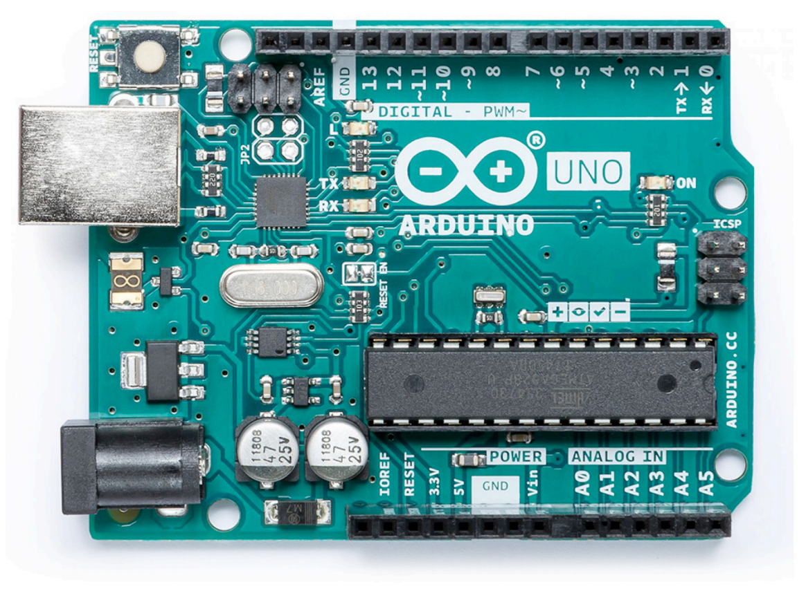
<figcaption>Er bestaan verschillende soorten Arduino’s en veel vergelijkbare microcontrollers, maar de Arduino Uno
die je hierboven ziet is het bekendst.</figcaption>

Op de Arduino zie je nummers en markeringen staan die aangeven wat je erop kunt
aansluiten. ‘3.3V’ en ‘5V’ zijn de pinnen waar je stroom met die voltages uit kunt
halen. Je zou ze kunnen zien als de plus van een batterij. De min van het Arduinobordje vind je bij ‘GND’.

Verder zie je 14 digitale pins en 6 analoge pins, die we allemaal kunnen gebruiken als inputs én als outputs.

## De software installeren
We hebben de Arduino-software nodig om het Arduino-bordje te kunnen
programmeren. Om de software te downloaden ga je naar [arduino.cc/download](https://arduino.cc/download).

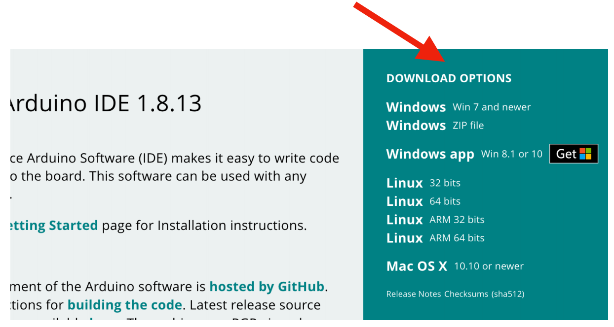

Kies je besturingssysteem (Windows, Linux of Mac) in het dondergroene vlak met
de titel ‘Download options’. (Heb je Windows? Kies dan de bovenste optie.)
In het volgende scherm kun je klikken op ‘Just download’. Als het bestand gedownload is, kun je het Arduino-programma
installeren en openen.

## Je eerste Arduino-programma
De stukjes software die we maken voor de Arduino noemen we schetsen (in het Engels ‘sketches’) of gewoon programma’s. 
Schetsen zijn tekstbestandjes waar instructies voor het Arduino-bordje in staan. Programmeurs noemen zulke instructies 
ook wel ‘code’. Je gaat nu je eerste Arduino-programma maken door een bestaand voorbeeld te openen en aan te passen.

Open het menu Bestand, dan Voorbeelden, Basics en klik dan op Blink. De schets
dat zich nu opent in een nieuw venster gaan we uploaden naar de Arduino.

Sluit het Arduino-bordje aan op je computer met een USB-kabel.

Klik op het tweede icoontje van links:

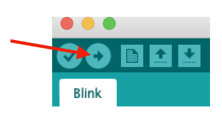

Het Arduino-programma zal de schets nu op de chip van de Arduino gaan zetten.

Mogelijk krijg je de eerste keer een venster te zien waarin je moet aangeven waar
de computer de Arduino kan vinden. Kies daar voor een adres met ‘usb’, ‘serial’ of
‘COM’ erin, en niet voor ‘bluetooth’.

Als je linksonder in het scherm ‘Uploaden voltooid’ ziet, dan is het gelukt en is er nu
op de Arduino een LED-lampje aan het knipperen!

Als je een foutmelding krijgt, bekijk dan de pagina ‘Problemen oplossen’ achteraan deze handleiding.

### Oefening

 1. Kun je het LED-lampje sneller laten knipperen?  
    Let op: als je iets in de schets verandert, moet je hem opnieuw uploaden.
 2. Kun je de LED in verschillende patronen laten knipperen?  
    Kun je bijvoorbeeld SOS knipperen?

## Hoe zit een Arduino-programma in elkaar?

Belangrijk om door te hebben: bijna alle Arduino-schetsen hebben drie onderdelen.

In het eerste deel, helemaal bovenaan in de schets, worden vaak wat variabelen
klaargezet. (Hoe variabelen werken kun je verderop in deze handleiding lezen.)

In het geval van Blink staat daar alleen wat commentaar. Alle regels met twee
schuine strepen ervoor zijn toelichting. Zulke regels staan er om aan jou uit te
leggen hoe het programma werkt. Alle regels tussen /* en */ zijn ook commentaar.
(Je herkent commentaar ook aan de grijze kleur van de tekst.)

Het tweede deel is een functie die ‘setup’ heet. Alles wat daarin staat, wordt één
keer uitgevoerd.



void setup() {
   // alles wat tussen de accolades (de gekrulde haakjes) staat, hoort bij
   // setup en wordt in één keer uitgevoerd.
   // In Blink wordt bijvoorbeeld het ingebouwde LED-lampje op
   // het Arduino-bord aangemeld als output:
   pinMode(LED_BUILTIN, OUTPUT);
}



Het derde deel van de schets is de functie die ‘loop’ heet. Dit deel van het
programma wordt steeds weer opnieuw gedaan, voor altijd.



void loop() {
   digitalWrite(LED_BUILTIN, HIGH); // zet de LED aan (HIGH is het voltage niveau)
   delay(1000);                     // wacht een seconde
   digitalWrite(LED_BUILTIN, LOW);  // zet de LED uit (bij LOW is de spanning uit)
   delay(1000);                     // wacht een seconde
}


<figcaption>De ingebouwde LED is op de Arduino Uno aangesloten op pin 13. ‘LED_BUILTIN’ is een woord dat 2
Arduino herkent, maar je zou in plaats daarvan ook ‘13’ kunnen schrijven.
</figcaption>

In Blink bijvoorbeeld wordt in loop() het ingebouwde LED-lampje aangezet 2
(‘HIGH’), dan wordt er een seconde gewacht (duizend milliseconden), dan wordt de
LED weer uitgezet (‘LOW’), dan wordt er weer een seconde gewacht, en dan begint
loop() weer opnieuw.

## Hoe een breadboard werkt

Om sensors en andere componenten te verbinden met de Arduino (of met elkaar), is het vaak handig om een 
breadboard te gebruiken.

De gaatjes op het breadboard zijn binnenin het plastic bordje met metalen strips met elkaar verbonden. 
De gaatjes in het midden zijn verbonden in kolommen van vijf (zoals die in het groene kader hiernaast).

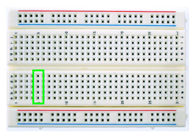
<figcaption>De letters en cijfers op het breadboard gebruiken we
meestal niet.</figcaption>

Die vijf gaatjes zijn alleen met elkaar verbonden, dus niet met gaatjes ernaast of met gaatjes aan de overkant van de 
kloof in het midden.

De horizontale rijen bovenaan en onderaan, met de rode en blauwe lijnen ernaast,
gebruiken we om meerdere onderdelen van stroom te voorzien. Rood is plus en
blauw (of zwart) is min, net zoals batterijen een plus en een min hebben.
Die gaatjes zijn alleen verbonden met de andere gaatjes in dezelfde horizontale rij,
dus niet niet met de gaatjes erboven of eronder.

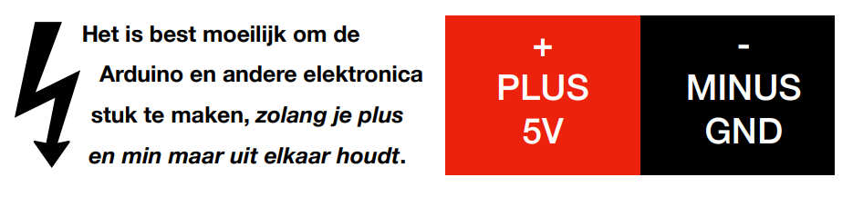

Het is daarom verstandig om je altijd aan de juiste kleuren te houden: de rode rij op
het breadboard voor plus en de blauwe rij voor min. Gebruik ook zoveel mogelijk
rode draadjes om componenten met de positieve kant te verbinden, en zwarte of
blauwe draadjes voor de verbinding met de negatieve kant.

## Digitale sensors: een knop

Een Arduino programmeren om lampjes te laten knipperen is leuk, maar eigenlijk
willen we dat hij ook kan reageren op zijn omgeving. Laten we dat nu proberen.

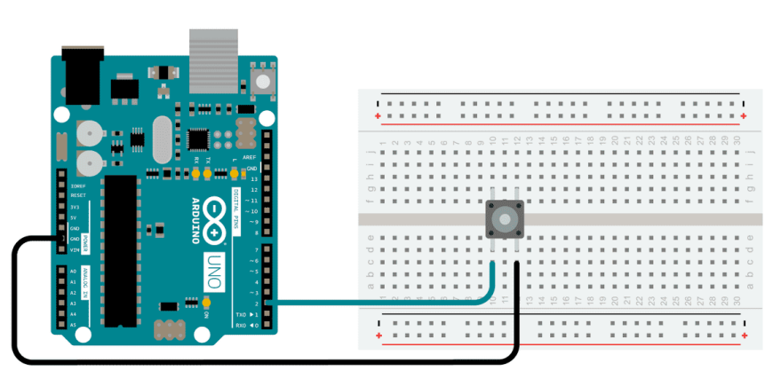

Verbind eerst een drukknop met de Arduino zoals op de tekening:

 - Zet de knop op het breadboard met twee pootjes aan elke kant van de gleuf in het midden (als het zo dadelijk niet 
   werkt, moet je de knop misschien een kwartslag draaien).
 - Verbind één kant van de knop met één van de gaatjes van de Arduino waar GND naast staat. De andere kant van de 
   knop verbind je met het gaatje waar ‘2’ bij staat (niet ‘A2’).
   
Open nu de schets die bij deze schakeling hoort, via het menu Bestand >
Voorbeelden > Digital > DigitalInputPullup.

Upload de schets naar de Arduino.

Probeer de knop maar. Als het goed is, heb je nu je eerste werkende digitale
sensor! Als je op de knop drukt, gaat de LED aan. Dit is dus al meteen een
combinatie van input en output.

### Hoe werkt het?

In het programma zie je dat in de functie setup() pin nummer 2 als een ingang
wordt ‘opengezet’:



pinMode(2, INPUT_PULLUP);



Op die pin heb je de knop aangesloten, en dankzij deze regel in de schets weet de
Arduino dat ook.

Vervolgens wordt pin nummer 13 als een uitgang gedefiniëerd:



pinMode(13, OUTPUT);



De ingebouwde LED op de Arduino is verbonden met pin 13, en dankzij deze regel
weet de Arduino dat we die willen gaan gebruiken.

Nu gaan we in de gaten houden of de knop wordt ingedrukt. Dat doen we met de
functie digitalRead():



int sensorVal = digitalRead(2);



Als je op de knopt drukt die is verbonden met pin 2 van de Arduino, levert
digitalRead hier een 0 op. Als je de knop loslaat, wordt dat een 1. Die waarde
wordt vervolgens bewaard in een variabele die ‘sensorVal’ heet (meer uitleg over
variabelen lees je verderop).
<figcaption>Daarom is een knop een voorbeeld van een digitale sensor: er zijn maar twee mogelijkheden. Andere 
voorbeelden van digitale sensoren zijn bewegingsensors (zoals PIR-sensors die automatisch het licht
aandoen in WC’s) en ‘oogjes’ zoals bovenaan roltrappen.</figcaption>

Dit alles staat in de functie loop(), wat betekent dat digitalRead() steeds opnieuw
wordt uitgevoerd en de knop dus continu in de gaten wordt gehouden. ‘sensorVal’
bevat steeds de huidige stand van de knop, 1 of 0, aan of uit.

Om iets te doen met de informatie die de sensor doorgeeft, staat in de schets
vervolgens een if-statement. Hoe dat werkt, lees je hierna

## If-statements

Om de Arduino iets te laten doen als er iets verandert, moeten we hem leren om
vragen te stellen. Een vraag in Arduino ziet er zo uit:



if (sensorWaarde > 30) {
    // doe hier iets
}



Dit heet een if-statement. Je laat Arduino vragen: is de knop ingedrukt? Of, zoals in
het voorbeeld hierboven: is het getal dat de sensor teruggeeft groter dan 30? Als
het antwoord op zo’n vraag ‘ja’ is, dan voert Arduino de code uit die tussen de
gekrulde haken staat.

In de DigitalInputPullup-schets van zojuist ziet dat er zo uit:



if (sensorVal == HIGH) {
    digitalWrite(13, LOW);
} else {
    digitalWrite(13, HIGH);
}


<figcaption>Door hoe we de knop hebben aangesloten, betekent ‘HIGH’ in dit geval dat de knop niet wordt ingedrukt.</figcaption>

Hier wordt eerst gevraagd: wordt de knop ingedrukt? Als dat niet zo is, dan zetten
we het LEDje uit, en anders zetten we het aan. Dit is dus een uitbreiding op het if-statement: met ‘else’ kunnen we 
instructies toevoegen voor het geval het antwoord op de vraag ‘nee’ is.

### Interpunctie

Merk op dat elke haakje openen een haakje sluiten nodig heeft, dus ‘(’ en ‘)’, en ‘{’
en ‘}’. Elk commando zoals digitalWrite() moet eindigen op een puntkomma.
Programmeertalen zijn heel gevoelig op dit soort dingen en zullen niet meewerken
als je dit soort dingen verkeerd doet. Als je toch foutmeldingen krijgt, kijk dan naar
de paragraaf ‘Problemen met de code’ aan het eind van deze handleiding.

### Oefening

Nu gaat de LED aan als je de knop indrukt. Kun je de code zo aanpassen dat de
LED juist uitgaat als je de knop indrukt?

## Zien wat er gebeurt: de seriële monitor

Stel je voor dat er iets misgaat, bijvoorbeeld dat er níet een LEDje gaat branden als
je op de knop drukt. Dan zou het handig zijn als de Arduino zelf kon vertellen of hij
ten minste ziet dat de knop wordt ingedrukt, want dat zou ons helpen te ontdekken
wat het probleem is. Gelukkig kan de Arduino dat.

We kunnen een communicatieverbinding opzetten tussen de computer en het
Arduino-bordje. Dat doen we door deze regel in setup() te zetten (in de
DigitalInputPullup-schets staat dit er al):



Serial.begin(9600);



In loop() zetten we direct onder de regel waar we de sensor uitlezen deze regels:



Serial.print("sensor = ");
Serial.println(sensorValue);



Open vervolgens de seriële monitor door te klikken op het vergrootglasicoontje rechtsbovenaan in het venster.

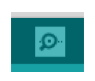

Als de schets van de knop (DigitalInputPullup) nog steeds op de chip van de
Arduino staat, dan zou je nu in de seriële monitor moeten kunnen zien of de knop
wordt ingedrukt. Als je niks ziet veranderen, dan weet je dus dat de knop het niet
doet of niet goed is verbonden met pin 2.

De seriële verbinding is vaak enorm handig om te
kijken of Arduino doet wat wij in gedachte hadden, en
zo niet, waar het probleem dan zit.

We kunnen de verbinding ook gebruiken om sensordata uit de Arduino te gebruiken in andere software op
de computer, bijvoorbeeld om interactieve animaties of
muziek te maken.


Die 9600 is de baud rate, de snelheid waarmee de computer en de Arduino met elkaar praten. Sommige schetsen gebruiken
andere waardes zoals 115200. De baud rate in de seriële monitor moet overeen komen met die in de schets, anders zie je
rare tekens of gewoon niets.
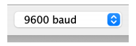


## Analoge sensors

De knop die we tot nu toe gebruikt hebben, is een soort digitale sensor. Zulke
sensoren kennen alleen 1 en 0, oftewel aan en uit, LOW en HIGH.

Er zijn ook een heleboel analoge sensoren, die tussenwaardes kunnen
geven. Een voorbeeld daarvan is een lichtsensor, die kan laten weten
of het donker is of juist heel erg licht, maar die ook alle gradaties
ertussenin kan meten.

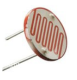

Een ander voorbeeld van een analoge sensor is de potmeter of
potentiometer. Dat is een draaiknop die je het beste kent als
volumeknop op versterkers. In Arduino kun je heel precies de
positie zien van de draaiknop.

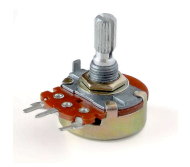

Sluit de potmeter aan zoals op de
afbeelding: de middelste pin op de
analoge poort A0, en de buitenste pinnen
op 5V en GND.

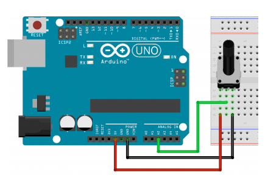

Open vervolgens dit programma:
Bestand > Voorbeelden > 03. Analog >
AnalogInput.

Upload de schets naar de Arduino. Als het goed is kun je nu de LED sneller en
langzamer laten knipperen door aan de knop te draaien!

Ook leuk: probeer de waardes die van de potmeter komen te bekijken met de
seriële plotter. Hoe dat moet, wordt onthuld op de volgende pagina.

### Oefening

Sluit een kleine speaker of ‘buzzer’ aan op GND en pin 13
(via het breadboard). Dat is dus op dezelfde pin als de
interne LED van de Arduino. Hoor je een verschil als je aan
de knop draait?

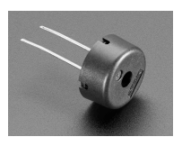

## Seriële plotter

Om analoge waarden goed te kunnen laten zien, heeft de Arduino-software een
geweldige feature in huis.

Open het menu Hulpmiddelen en klik op Seriële plotter (sluit eerst de seriële
monitor als dat venster nog openstaat). *De sneltoets-combinatie voor de seriële plotter is shift+command+L.*

Open de schets AnalogReadSerial via het menu Bestand > Voorbeelden > 01.
Basics > AnalogReadSerial, en upload het naar de Arduino.

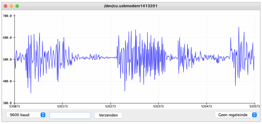

Je zou in het venster van de seriële plotter nu een grafiek moeten zien van de veranderingen in de positie 
van de potmeter! (Of de resultaten van een andere analoge sensor, zoals bijvoorbeeld de lichtsensor.)

### Meerdere sensoren

Als je de resultaten van meerdere sensoren in de seriële plotter wil zien, dan moet
je zorgen dat die waardes gescheiden door tabs worden doorgestuurd:



Serial.print(sensor1);  // waarde van de eerste sensor
Serial.print(",\t");    // waardes gescheiden door komma en tab
Serial.print(sensor2);  // waarde van de tweede sensor
Serial.println();       // witregel



Het helpt om verder geen print()’s in je programma te hebben die tekst schrijven
naar de seriele verbinding (zoals je soms wel doet om feedback van je schets te
zien in de seriële monitor). Als je zulke print()’s met tekst wel hebt in je schets,
misschien moet je ze dan even tijdelijk uitschakelen door er met // commentaar van
te maken.

## Ultrasone afstandssensor

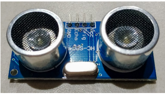

Als je wil weten hoe ver iets of iemand is (bij je robot of kunstwerk vandaan bijvoorbeeld), dan is
een ultrasone afstandssensor geweldig. Er zitten twee ronde dingen op, een speaker en een microfoon. De sensor werkt 
door met de speaker een ultrasoon geluid te maken, en vervolgens met de microfoon te meten hoe lang het duurt 
voordat de echo van dat geluid terugkomt. Door die tijd te delen door snelheid van het geluid, kan de Arduino
uitrekenen hoe ver weg iets is.  
*343 meter per seconde; de gevonden tijd wordt ook nog door 2 gedeeld, omdat het geluid twee keer de 6
afstand heeft afgelegd als de echo wordt opgevangen.*

Je sluit de sensor zo aan op de Arduino, eventueel via een breadboard:
 - de pin op de sensor waar VCC bij staat naar 5V op de Arduino,
 - GND op de sensor naar GND op de Arduino,
 - Trigger naar digitale pin 12 van de Arduino,
 - Echo naar pin 11 van de Arduino.

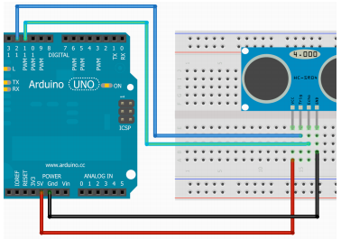

Je kunt code voor dit type sensor overal online
vinden, maar de NewPing-library is erg
makkelijk te gebruiken. Die moet je dan wel
even installeren—als je nog niet weet hoe dat
moet, kijk dan even op de pagina ‘Libraries
installeren’ verderop.

In het voorbeeldprogramma NewPingExample
(zie Bestand > Voorbeelden > NewPing) kun je
zelf de maximale afstand instellen die je wil
meten. Een meter of vier à vijf is wel het
maximaal haalbare met deze sensor.  
*Meer informatie over de NewPing-library vind je hier: https://bitbucket.org/teckel12/arduino-new-ping*

Upload de code naar de Arduino, en open de
seriële monitor om de afstand te zien die de
sensor meet.


Ultrasone afstandssensors meten de
afstand tot objecten in een smalle strook
van 15 graden. Als je een breder gebied
wil scannen, dan zou je meerdere
ultrasone sensors naast elkaar kunnen
zetten, of een enkele sensor op een
motortje kunnen zetten om een
draaiende radar te maken. Een meer
complete oplossing is beeldherkenning,
maar dat is ook een stuk ingewikkelder.
Als je alleen maar wil weten óf iemand in
de buurt is (en niet per se hoe ver weg
ze zijn), gebruik dan een PIR-sensor.


## Variabelen

Variabelen zijn woorden of letters waarmee we Arduino iets kunnen laten
onthouden. Dat is belangrijk als we Arduino bijvoorbeeld willen laten bijhouden hoe
vaak iets is gebeurd.

Een variabele definiëren ziet er zo uit:



int aantal = 100;



Door ‘int’ ervoor te zetten zeggen we: de variabele is een heel getal, dus geen
decimaal. Dan geven we de variabele zijn naam. In dit geval is dat ‘aantal’, maar
het zou net zo goed ‘x’ mogen zijn, of ‘sensorWaarde’. Meestal kiezen we een
naam die goed duidelijk maakt wat voor informatie we willen opslaan in die
variabele. Vervolgens vertellen we de variabele wat zijn beginwaarde wordt—in dit
geval 100. Tot slot wordt de regel afgesloten met een puntkomma, net als alle
commando's in Arduino.  
*Andere typen variabelen zijn bijvoorbeeld float (dat is wel een decimaal getal) en bool (alleen ‘true’ of 8
‘false’). Je vindt alle typen op https://www.arduino.cc/reference/en/ onder ‘Data Types’.*

Als je een variabele eenmaal op die manier gedefiniëerd hebt, dan kun je met die
variabele gaan rekenen. Als we dit doen…



aantal = aantal + 100;



… dan heeft ‘aantal’ nu een waarde van 200.

### Oefening

Met variabelen kun je bijvoorbeeld ook bijhouden hoe vaak een knop is ingedrukt.
Je kunt daarvoor de schets DigitalInputPullup gebruiken (zie eventueel de pagina
over digitale sensors). Probeer het eerst zelf, en lees eventueel daarna de oplossing.

mogelijke oplossing

Voeg een variabele toe bovenaan in de schets (dus nog boven setup()). Tel vervolgens steeds 1 bij op, op 9
de plek waar de schets iets doet op het moment dat de knop wordt ingedrukt. Verplaats de Serial.println
naar diezelfde plek om in plaats van ‘sensorVal’ de waarde van jouw variabele naar de seriële monitor te
schrijven. Als je onder die regel ook nog ‘delay(500);’ toevoegt, dan wacht de Arduino een halve seconde
voordat hij verdergaat. Op die manier telt hij steeds maar één druk op de knip in plaats van dat hij doortelt
zolang als de knop is ingedrukt :-)

## Inputs en outputs combineren

Vaak willen we met de Arduino meerdere inputs en outputs tegelijk gebruiken én ze
laten samenwerken. Je kunt bijvoorbeeld een potentiometer gebruiken om de
snelheid van een motor te veranderen, of een lichtsensor gebruiken om de
toonhoogte van een buzzer te verhogen of te verlagen. Hier lees je hoe dat moet.

### Stap 1

Als je twee componenten met elkaar wil laten samenwerken, laat ze dan altijd eerst
apart werken. Als er dan later iets niet werkt, weet je dat het in ieder geval niet ligt
aan de individuele componenten en dat maakt het zoeken naar een oplossing veel
makkelijker.
Dus bijvoorbeeld:
 - Sluit de potmeter aan op de Arduino
 - Upload het programma voor de potmeter naar de Arduino, en zorg dat je de waarden van de potmeter te zien krijgt in de seriële monitor.
 - Sluit vervolgens de buzzer aan (laat de potmeter aangesloten!).
 - Zet de software voor de buzzer op de Arduino (laat het venster met de code met de potmeter openstaan), en ga pas verder als je de buzzer hoort.

### Stap 2
Nu heb je dus twee werkende programma’s,
en die kun je gaan combineren tot één
programma. Zet ze naast elkaar, zodat je
beide vensters op je beeldscherm hebt.

<figcaption>DigitalInputPullup</figcaption>


void setup() {
    Serial.begin(9600);
    pinMode(2, INPUT_PULLUP);
    pinMode(13, OUTPUT);
}

void loop() {
    int sensorVal = digitalRead(2);

    if (sensorVal == HIGH) {
        digitalWrite(13, LOW);
    } else {
        digitalWrite(13, HIGH);
    }
}



<figcaption>Sweep</figcaption>


#include <Servo.h>
Servo myservo;

void setup() {
    myservo.attach(9);
}

void loop() {
    myservo.write(10);
    delay(1000);
    myservo.write(160);
    delay(1000);
}



In Arduino-schetsen mogen setup() en loop()
maar één keer voorkomen. We kunnen de
schetsen dus niet combineren door ze
simpelweg de ene onder de andere te plakken.

Kopiëer daarom de inhoud van de ene setup() naar de andere. Let op dat je geen
accolades (gekrulde haken) meekopiëert. Let ook goed op dat je geen code boven
of onder de accolades van setup() plaatst—de code hoort tussen { en } want anders
werkt het niet.

Doe hetzelfde voor loop() en eventuele
regels die nog bóven setup staan.

Voor de afgebeelde schetsen ziet dat er zo uit:

<figcaption>Gecombineerd</figcaption>


#include <Servo.h>
Servo myservo;

void setup() {
    Serial.begin(9600);
    pinMode(2, INPUT_PULLUP);
    pinMode(13, OUTPUT);
    myservo.attach(9);
}

void loop() {
    int sensorVal = digitalRead(2);

    if (sensorVal == HIGH) {
        digitalWrite(13, LOW);
    } else {
        digitalWrite(13, HIGH);
    }

    myservo.write(10);
    delay(1000);
    myservo.write(160);
    delay(1000);
}



### Stap 3

Laat je nieuwe schets controleren door Arduino. Gebruik daarvoor het eerste
icoontje, links bovenaan. Als je linksonderin ziet ‘Compileren voltooid’ dan heb je
het samenvoegen goed gedaan! Als je een foutmelding krijgt, los het probleem dan
op. Gebruik eventueel de checklist aan het eind van deze handleiding.
Sla je gecombineerde schets op op je computer, via Bestand > ‘Opslaan als…’.


Soms wil je twee schetsen combineren
die allebei dezelfde pin in gebruik
hebben. Als je die schetsen
samenvoegt, zul je dus voor één van
die twee inputs of outputs een andere
pin moeten gebruiken en dat onderdeel
dan dus ook op die andere pin op de
Arduino moeten aansluiten.


### Stap 4
Nu heb je een schets die met twee componenten
werkt. Als je hem uploadt naar de Arduino, dan
zouden dus beide onderdelen het moeten doen.

Maar je wil natuurlijk dat beide componenten
sámenwerken! Het makkelijkste is een if-statement gebruiken (zie de pagina daarover).
Een andere mogelijkheid is de sensor-data direct
gebruiken voor een output; je zou bijvoorbeeld
waardes uit een lichtsensor direct kunnen
gebruiken als de graden voor een servo-motor.


In Arduino-schetsen wordt vaak
gebruik gemaakt van de functie
delay(). Dat levert echter nogal
eens problemen op als je de
Arduino twee of meer dingen
tegelijk willen laten doen. De
oplossing daarvoor is een timer
zetten; hoe dat moet, lees je op de
pagina’s verderop over timers en
millis().


### Bestaande code gebruiken
Wat je óók kunt doen, is code van anderen gebruiken. Stel dat je een
kleurensensor wil gebruiken samen met een paar LED-lampjes, dan kun je bij
Google iets intypen als ‘Arduino kleurensensor LEDs’. Je vindt ongetwijfeld een
heleboel handleidingen die laten zien welke onderdelen ze gebruikten en hoe,
inclusief de nodige code.

Als je zulke code overneemt, lees die code dan in ieder geval goed door en probeer
te begrijpen wat elk stukje doet. Als de code niet werkt, gebruik dan de checklist
aan het eind van deze handleiding om het probleem op te lossen.

## Dingen laten bewegen met servo-motors

De simpelste manier om met de Arduino iets te laten
bewegen (robotjes, plotters, bloempotten die naar het
licht draaien) is een servo. Er zijn twee soorten:
servo’s die draaien tussen 0 en 180 graden, en servo’s
die door kunnen blijven draaien.  
*Zulke ‘continuous’ servo’s vertalen de richting die je ze opgeeft in een draairichting en snelheid. ‘0’ is 10
bijvoorbeeld volle snelheid naar links, ‘90’ is stilstaan en ‘110’ betekent ‘draai langzaam naar rechts’. Als je
bij zo’n servo toch wil weten hoe ver hij is gedraaid, heb je een ‘rotary encoder’ of ‘encoder wheel’ nodig.*

De meeste kleine servo-motors hebben drie draadjes:
- bruin is ground, dus min
- rood is voltage, dus plus
- geel is de pin waarop de Arduino de servo aanstuurt.
  
Sluit de servo aan, met de gele draad op pin 9. Als je deze schets uploadt, gaat het
motortje heen en weer draaien: Bestand > Voorbeelden > Servo > Sweep

Zoals je ziet in de code, wordt de servo naar een bepaalde plek gestuurd met de
functie myservo.write(). In de schets gebeurt dat in een for-loop om hem
stapsgewijs heen en weer te laten draaien, maar je kunt de servo bijvoorbeeld ook
naar de middenpositie sturen met het commando

### Grotere servo’s

De servo zoals op de foto is klein
en niet erg sterk. Er zijn ook (veel)
sterkere servo’s. Die kun je ook
met de Arduino aansturen, maar
om ze van stroom te voorzien is
een externe batterij nodig:

### Oefening

Stuur de servo een paar keer naar verschillende standen, en laat hem tussendoor
een seconde wachten. Hint: de for-loops heb je hiervoor niet nodig, want aan een
paar myservo.write’s en delay()’s heb je genoeg.

## Tot slot

Je kunt met de Arduino ontelbaar veel combinaties maken met verschillende inputs
en outputs. Je kunt bijvoorbeeld een MP3-speler geluiden laten horen als een
bewegingssensor beweging detecteert, of LED-strips van kleur laten veranderen op
basis van een hartslag die je meet met een hartslagsensor.

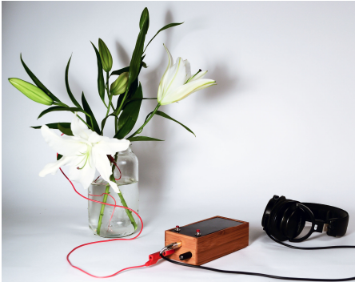

Wat je kunt maken met elektronica wordt praktisch nergens meer door beperkt. Onderdelen zijn ontzettend goedkoop
geworden, en de informatie over hoe je ze moet aansluiten en kunt gebruiken is altijd online te vinden. Zoek bijvoorbeeld
op Google naar ‘Arduino planten vochtsensor’ en je vindt duizenden handleidingen die niet alleen laten zien
hoe je zo’n sensor aansluit op je Arduino, maar die ook de nodige code delen.

Een paar sites zijn met name aan te raden voor inspiratie en praktische informatie:
- Instructables: https://www.instructables.com/circuits/arduino/projects/
- Arduino: https://blog.arduino.cc/ en https://www.arduino.cc/reference/en/
- Hackster.io: https://www.hackster.io/arduino

Het belangrijkste is dat je ziet dat iedereen kan programmeren en toffe dingen kan
maken met elektronica. Niemand kan of weet alles meteen, maar met oefening en
gewoon blijven proberen kom je heel ver. Er is ontzettend veel mogelijk, en jij hoort
bij de mensen die gave dingen kunnen maken.

## Extra
### Problemen oplossen
#### Problemen met verbinding
Dit is een lijst van mogelijke oplossingen als je er niet in slaagt om code te
uploaden naar de Arduino. Als de eerste oplossing niet helpt, probeer dan de
volgende oplossingen, in de volgorde waarop ze genoemd worden.
1. Selecteer de juiste poort.
   Als je een foutmelding krijgt bij het uploaden, dan is het meestal omdat de
   computer niet weet op welke USB-poort de Arduino te vinden is:  
     
   Je kunt dat oplossen door de juiste poort te selecteren in het menu
   Hulpmiddelen onder ‘Poort’. Soms staat er al bij waar de Arduino is verbonden,
   maar de kans bestaat dat je zelf moet raden. Het zou een adres moeten zijn
   met ‘usb’ erin, ‘serial’ of ‘COM’.
   Zorg dat onder ‘Board’ de juiste Arduino is geselecteerd (meestal Arduino Uno).
2. Zit de USB-kabel er aan beide kanten goed in?
3. Probeer eens een andere USB-poort (en dan weer stap 1).
4. Herstart de Arduino-software.
5. Probeer het uploaden zonder dat er iets met de Arduino verbonden is. (Als dit
   helpt dan is er ergens kortsluiting óf is er iets verbonden met de verkeerde pin.)
6. Herstart de computer (en zie dan weer stap 1).
7. Als je computer de Arduino niet kan vinden onder ‘Poort’, dan kan het nodig zijn
   om een driver installeren. Voer de instructies uit op https://www.arduino.cc/en/
   Guide/DriverInstallation (en doe dan weer stap 1).
8. Probeer een andere Arduino

#### Problemen met de code
De foutmeldingen die Arduino geeft onderin beeld zijn vaak behoorlijk helder.
Probeer ze te begrijpen zodat je sneller een probleem kunt opsporen en oplossen.
1. Waar zit de fout? Vind de regel die rood is gemaakt. De fout kan ook direct
   boven die regel zitten.
2. De meest voorkomende fout is dat een functie of commando niet goed
   afgesloten wordt. Staat er een ‘}’ te veel of te weinig? Zorg dat er voor elke ‘(’
   een ‘)’ is en voor elke ‘{’ ook een afsluitende ‘}’ en dat elk commando wordt
   afgesloten met een puntkomma.
3. Staat alle code wel echt ín setup() of loop()? Dus binnen de gekrulde haken van
   een van beide functies?
4. Als je schets een library aanroept die niet gevonden kan worden, dan krijg je de
   foutmelding ‘No such file or directory’. Installeer in dat geval alsnog de
   bijbehorende library; zie daarvoor de pagina ‘Libraries installeren’ in deze
   handleiding.
5. Zoek online naar oplossingen voor de foutmelding die je krijgt. Zoek naar
   ‘Arduino “exacte foutmelding tussen aanhalingstekens”’.
6. Gebruik een heel andere schets. Probeer een van de voorbeeldschetsen in
   Arduino en pas die aan, of probeer online code te vinden die doet wat jij wil.

#### Geen foutmelding, maar toch niet de werking die je verwacht?
- Check of de componenten echt met de juiste pinnen zijn verbonden en dat dat
  ook de pinnen zijn die genoemd worden in de code.
- Bij gebruik van een breadboard: zitten de componenten écht op het goede rijtje?
- Gebruik Serial.println()’s om te weten wat de Arduino aan het doen is (zie de
  uitleg daarover op de pagina over de seriële plotter).
- Probeer een ander exemplaar van het onderdeel dat je probeert aan te sluiten,
  om te zien of dat misschien het probeem is. Probeer eventueel ook andere
  draadjes of zelfs een ander breadboard.

### Libraries installeren
Je hoeft lang niet alles helemaal zelf te programmeren. Er is al heel veel software geschreven door mensen
die hun werk graag met je delen (dat heet open-source software en het is geweldig!).

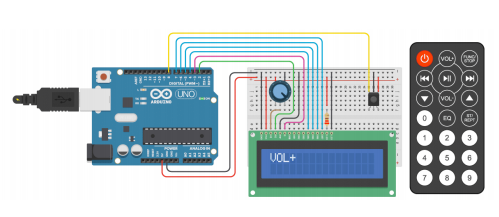

Als zulke software uitgebreider is dan een enkele schets, dan heet zo’n software-pakketje een bibliotheek, of library.
Het Arduino-programma heeft een aantal libraries al voor-geïnstalleerd, maar soms zul je dat zelf moeten doen.

Stel dat je een infrarood-sensor wil uitproberen om met een afstandsbediening je Arduino-project te kunnen bedienen. Dat
wordt je makkelijk gemaakt door een library die IRremote heet.

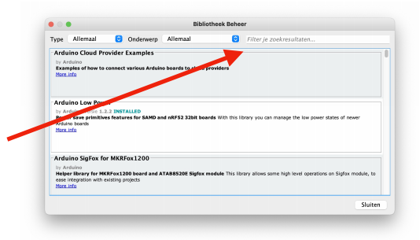

Ga naar het menu Hulpmiddelen > Bibliotheken beheren. Zoek op ‘IRremote’ in het zoekvenster,
en dan staat hij waarschijnlijk als tweede in de lijst resultaten.

Klik op ‘Installeren’ en dan ‘sluiten’.

Als je een library geïnstalleerd hebt, kun je via
Bestand > Voorbeelden de voorbeeldschetsen
openen die bij de library horen. Met die
schetsen kun je snel leren hoe je de library
kunt gebruiken in je eigen project.  
*In het geval van IRremote: Bestand > Voorbeelden > IRremote > IR receiveDemo. Meer uitleg over 12
  afstandsbedieningen en hoe je de library gebruikt vind je hier:
  https://www.circuitbasics.com/arduino-ir-remote-receiver-tutorial/*


Niet álle bibliotheken kun je op deze
manier installeren. Soms moet je een
map met bestanden downloaden en
die dan handmatig toevoegen aan de
map waar Arduino de bibliotheken
bewaart. De locatie van die map vind
je via het menu Arduino > Preferences.


### Een timer voor Arduino-programma’s: millis()

Als je Arduino twee dingen tegelijk wil laten doen, zoals
een lampje laten knipperen en ondertussen in de gaten
houden of een knop wordt ingedrukt, dan is het belangrijk
om géén delay() te gebruiken. De functie delay() zorgt
ervoor dat de de Arduino een tijdje wacht, en ondertussen
staat alles stil. Als hij bijvoorbeeld wacht tot de LED weer
aan of uitgezet kan worden, kan hij dus niet tegelijk in de
gaten houden of de knop wordt ingedrukt.

Om zoiets wel tegelijk te kunnen doen, laten we Arduino een soort stopwatch
gebruiken. Die stopwatch heet millis(). Met die functie kunnen we in de gaten
houden hoe lang onze schets al loopt, en op gezette tijden iets doen.

Hieronder zie je bijvoorbeeld een schets die elke drie seconden een LED aan- of
uitzet, zónder in de tussentijd alles te blokkeren met delay().  
*In het Engels heet deze oplossing ook ‘non-blocking code’, code die niet blokkeert. Er is een handige
library voor, die arduino-timer heet. Daarmee kun je meerdere ‘stopwatches’ in één schets hebben. Als je
hem installeert (zie ‘Libraries installeren’), zie je de mogelijkheden in de bijbehorende voorbeeldschetsen.*



// Begintijd is het aantal milliseconden sinds het script begon.
int begintijd = millis();

void setup() {
    pinMode(LED_BUILTIN, OUTPUT);   // Het ingebouwde LEDje op de Arduino activeren
}

void loop() {
    if ((millis() - begintijd) > 3000) {    // Zijn er al 3 seconden verstreken?
        // Zo ja, doe dan dit:

        // verander de LED naar aan of uit
        // (het uitroepteken betekent 'maak er van wat hij nu NIET is')
        digitalWrite(LED_BUILTIN, !digitalRead(LED_BUILTIN) );

        // reset de stopwatch: verander begintijd naar het aantal milliseconden NU
        begintijd = millis();
    }

    // Nu kunnen we hier andere dingen doen, zoals motortjes laten draaien, of in 
    // de gaten houden of knoppen worden ingedrukt, zónder te wachten op delays.
}



### Wat je kunt meten en doen met Arduino
| Inputs | Outputs |
|--------|---------|
| Afstandssensor | Licht: lampen, lasers, LEDs, EL wire, glasvezel |
| Accelerometer | Geluid: speakers, transducers, versterkers, MP3-spelers  *Er zijn er verschillende, maar deze is goedkoop en gemakkelijk aan te sluiten: https://wiki.dfrobot.com/DFPlayer_Mini_SKU_DFR0299* |
| Gyroscoop | Motoren: servo’s, heel precieze stappenmotoren, hele snelle DCmotoren, heel sterke gear motors, trilmotors, lineaire actuatoren, ventilatoren.|
| Kompas | Solenoids |
| Temperatuur | Elektromagneten, ferrofluids |
| Relatieve luchtvochtigheid | Video (animaties, video’s, VR/AR) |
| Vochtsensor (planten water geven!) | LCD-display (zoals in snoepautomaten) |
| Barometer | Pomp (bijv. om het te laten regenen of een beeld te laten huilen) |
| Lichtsensor | Metaal dat van vorm verandert |
| Kleurensensor | Warmte- en koel-elementen |
| Draaiknoppen en lineaire potmeters (zoals de schuiven op mengpanelen) | Rookmachine |
| Microfoons (of andere audio-signalen) | Website of sociale media (automatisch informatie posten op basis van sensorgegevens) |
| Aanraking | |
| Schakelaars | |
| Keyboard en muis | |
| Vingerafdruk | |
| Camera’s | |
| Bewegingssensor | |
| Infrarood-ontvanger (je project besturen met afstandsbediening!) | |
| Hartslag  *Sommige hartslagsensors werken amper. Deze is wat duurder, maar geeft wel redelijk goede meetresultaten: https://www.kiwi-electronics.nl/pim-438* | |
| Rook | |
| Gas | |
| Straling | |
| Vlammendetector | |
| Magneetvelden | |
| Trilling | |
| Buigsensor | |
| Stroming | |
| Hersenactiviteit | |

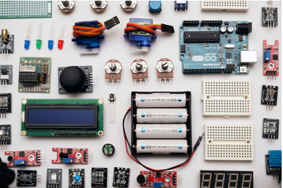

Dit is zeker geen complete lijst, maar je ziet vast zo al dat de mogelijkheden
eindeloos zijn. Welke combinaties van inputs en outputs lijken jou interessant?

## Licentie
Deze handleiding is geschreven door Jaap Meijers (instructeur/beheerder van het
Hacklab van de Koninklijke Academie van Beeldende Kunsten in Den Haag en mentor van [CoderDojo Nijmegen](https://coderdojo-nijmegen.nl)) en
gepubliceerd in mei 2021 onder de [Creative Commons Attribution 4.0 Internationallicentie](https://creativecommons.org/licenses/by/4.0/deed.nl).
Dat betekent dat je deze handleiding vrij mag verspreiden en aanpassen,
mits je de bron vermeldt en verwijst naar de licentie.

De broncode voor deze instructie vind je hier https://github.com/coderdojonijmegen/arduino-snelle-introductie.

### Verantwoording foto’s
* Arduino met relais en lamp: Adilson Thomsen/FilipeFlop/Wikimedia  
* Breadboard: Victoria.nunez2/Wikimedia  
* LDR: Arnau 944/Wikimedia  
* Potmeter: Iainf/Wikimedia  
* Piezo buzzer: Adafruit/Flickr  
* Ultrasone afstandssensor: Nowforever/Wikimedia  
* Microservo: eigen foto  
* Arduino met bloemen: madshobye/Instructables.com  
* Diagram IR-remote bij ‘Libraries installeren’: Benne de Bakker/makerguides.com  
* Stopwatch: Matthew/Flickr  
* Losse onderdelen: Robin Glauser/Unsplash  
* Diagrammen met potmeter, ultrasone afstandssensor en servo: Fritzing.org  
* Alle screenshots van Arduino IDE, diagram bij ‘Digitale sensors’ en de foto van Arduino-bord bij
‘Wat is de Arduino’: Arduino.cc